**Caso de estudio:** Clasificación de peces de en tres tipos de bacalao
para el reparto de trabajo en factoria pesquera. Dependiendo del tamaña
y del tipo de bacalao el proceso al que somete al pez es diferente por
lo que se hace necesario clasificar en 4 especies ( **HYSE , SEI, TORSK
, LASK**) y medir la longitud del pez. luego se envían a tolvas para su
procesado posterior. ver Imagen siguiente

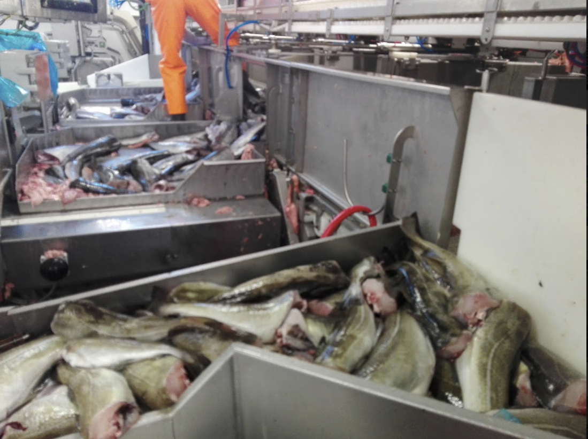{width="6.270833333333333in"
height="4.694444444444445in"}

**Problema:** clasificar los peces en 4 especies y medir su longitud.
Las especies son las siguientes: **HYSE,SEI,TORSK,LASK.**

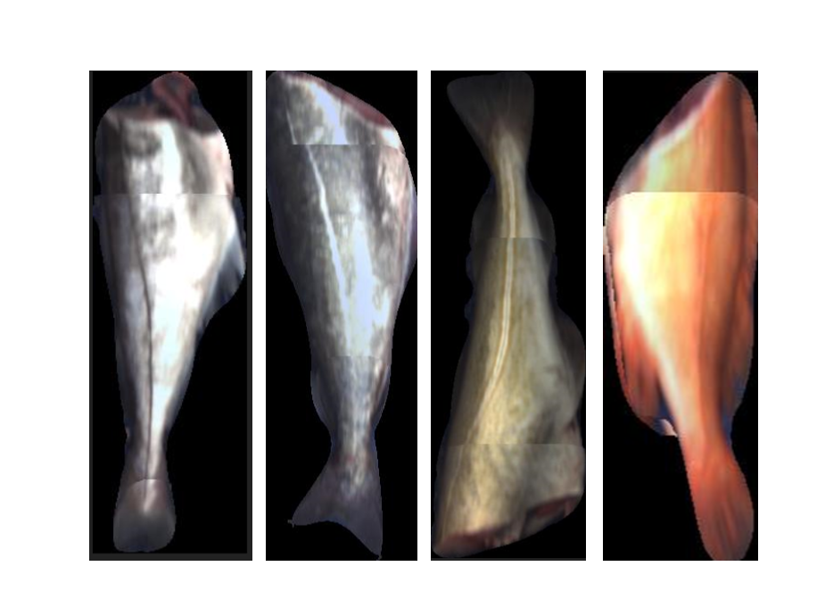{width="6.270833333333333in"
height="4.611111111111111in"}

La cámara captura los peces según llegan por la cinta de transporte,,
detecta el pez sobre la cinta y a partir de los fotogramas que tiene
elimina el fondo y monta el pez longitudinalmente, ya que el campo de
visión de la cámara no es suficiente para capturar el pez en un solo
fotograma. se puede apreciar en las imágenes superiores.

Así al sistema de clasificación le llegan las siguientes imágenes con
una cadencia de 2 peces por segundo

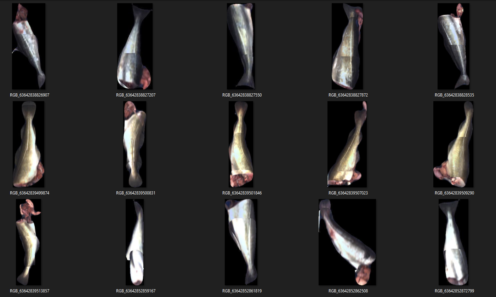{width="6.270833333333333in"
height="3.763888888888889in"}

Parece que las redes neuronales convolucionales pueden ser adecuadas
para extraer las características de las especias mediante entrenamiento
de las imágenes evitando tener que parametrizar las características para
luego clasificar. Con el objetivo de acelerar el proceso de
clasificación se van a probar redes convolucionales mas rápidas
**frcnn** con keras. (**faster RCNN**) estas son redes convolucionales
basadas en regiones.

El entrenamiento y la clasificación se ha hecho en una máquina en cloud
de google con una GPU tesla K80 de nvidia (colab)

Actualmente la extracción de características y clasificación se hacen en
menos de 500 msec con una tasa de acierto del 95 %, siendo necesario 30
minutos de entrenamiento.

#### **Faster R-CNN**

Es una RCNN donde el algoritmo de selective search se ha sustituido con
una red neuronal rápida. Específicamente, se introdujo la region
proposal network (RPN), una red de propuesta regional.

Cómo funciona el RPN:

-   En la última capa de una CNN inicial, una ventana deslizante de 3×3
    > se mueve a través del mapa de características para asignarle un
    > tamaño más pequeño (por ejemplo, 256-d).

-   Para cada posición de ventana deslizante, el RPN genera múltiples
    > regiones posibles basadas en uniones espaciales de dimensiones
    > fijas llamadas cajas de anclaje. (anchor boxes).

-   Cada propuesta regional consiste en:

-   un puntaje (score) para la presencia del objeto en esa región en
    > particular

4 coordenadas que representan el cuadro delimitador de la región.

En otras palabras, veamos nuestra región en el último mapa de
características, teniendo en cuenta los diferentes k caudros de anclaje
que lo rodean. Para cada cuadro, se muestra si esta tiene un objeto y
cuáles son las coordenadas del cuadro. En la imagen, se representa como
aparece desde la posición de una ventana deslizante:

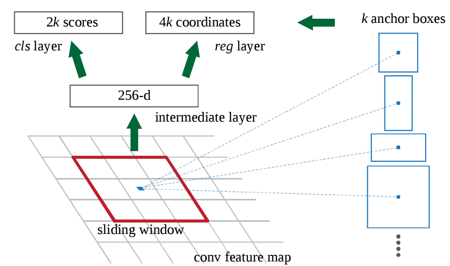{width="6.270833333333333in"
height="3.6944444444444446in"}

4 1

La puntuación de 2k representa la probabilidad dada por softmax para
cada caja k debido a la presencia de un objeto. Cabe señalar que, aunque
el RPN procesa las coordenadas de los cuadros delimitadores, no
clasifica los posibles objetos de todos modos: tiene el único propósito
de identificar regiones en las que hay objetos presentes , por lo tanto,
comunicar las coordenadas con los cuadros relacionados. Si un cuadro de
anclaje tiene una puntuación, relativa a la presencia de un objeto, por
encima de un cierto umbral, entonces esa casilla dada se seleccionará
como una posible región.

Teniendo ahora nuestras posibles regiones, las presentamos directamente
en el Fast R-CNN. Agregamos una capa de Pooling, algunas capas
completamente conectadas, finalmente una capa de clasificación softmax y
un regresor de cuadros delimitadores (cuadro delimitador regresivo).
Podemos decir que Faster R-CNN = RPN + Fast R-CNN.

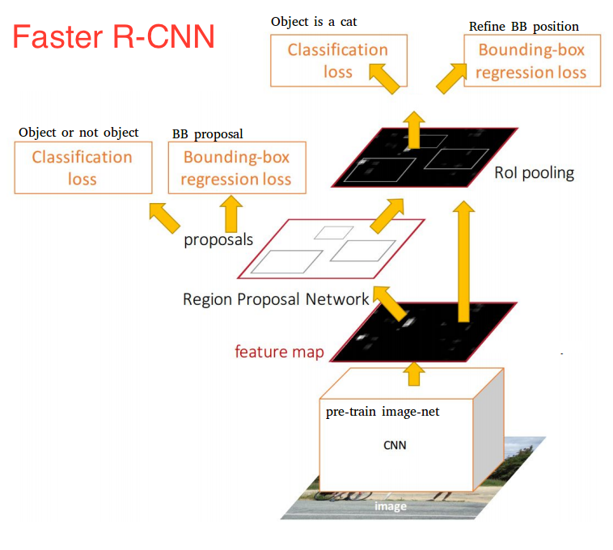{width="6.270833333333333in"
height="5.625in"}

El Faster R-CNN logra así una mejor velocidad y precisión. Aunque ha
habido múltiples intentos de aumentar la velocidad de reconocimiento de
los objetos, solo unos pocos modelos han sido capaces de superar esta
red. En otras palabras, el Faster R-CNN ciertamente no es el método más
rápido para la object detection, pero presenta uno de los mejores
rendimientos.

## Aplicación para el caso de los peces

Se ha utilizado una R-CNN VGG-16 y se ha cargado el modelo pre-entrenado
( nn_base) siguiente

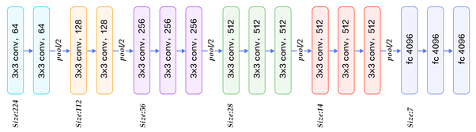{width="6.270833333333333in"
height="1.7361111111111112in"}

Para reentrenar el sistema se han utilizado imágenes que provienen del
archivo annotation.txt que contiene un grupo de imágenes con su
información de recuadros delimitadores necesarios para usar el método
RPN para crear los bboxes propuesta..

Para preparar los datos se ha utilizado el notebook
**Object_Detection_DataPreprocessing_granit.ipynb** que crear las
carpetas y ficheros necesarios para el entrenamiento del modelos con las
imagenes de ya entrenados y con las regiones definidas.

**frcnn_train_vgg.ipynb** entrena el modelo con las images de la carpeta
train y el fichero anotation.txt. Los resultados de cada época se
guardan en la fichero record.csv. Así los resultados de los
entrenamientos con los datos son los siguientes. Cada época consiste en
entrenamiento de 1000 imágenes generadas por data augmentation con
rotaciones, desplazamientos y espejos.

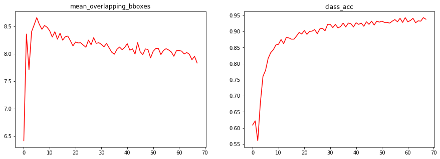{width="6.270833333333333in"
height="2.2777777777777777in"}

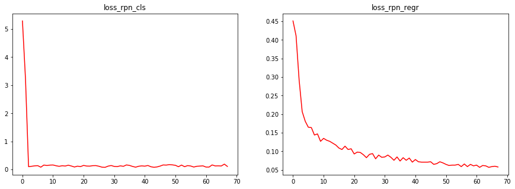{width="6.270833333333333in"
height="2.3055555555555554in"}

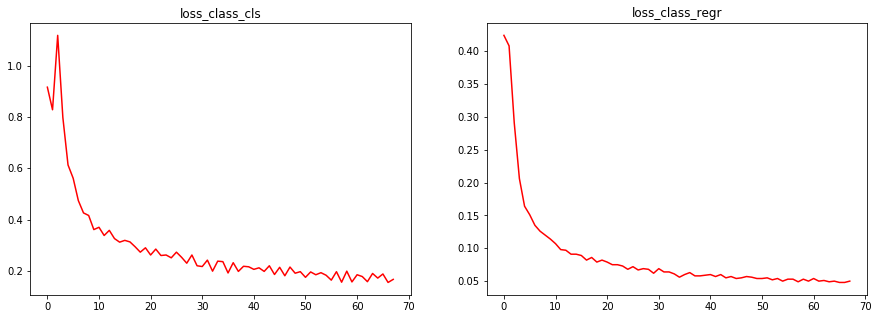{width="6.270833333333333in"
height="2.2777777777777777in"}

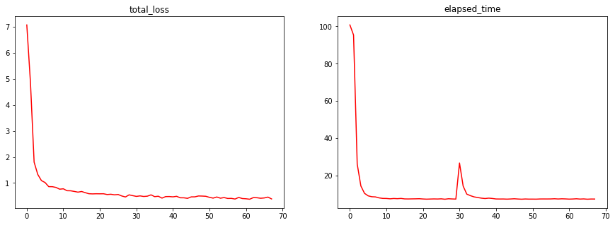{width="6.270833333333333in"
height="2.3055555555555554in"}

después de 68000 batches la precisión de la red es del 0.944% con un
tiempo de estimación de entre 2 y 0.5 segundos. El tiempo de
entrenamiento es de 6 horas por cada 40 épocas. Siendo el resultado
suficiente a partir de la época 30 asegurando co así que no hay
sobreentrenamiento.

**frcnn_test_vgg_granit.ipynb** este cuaderno permite ver el resultado
en imagenes seleccionadas del un directorio de gdrive con imágenes
capturadas en otro periodo con resultado similares a los anteriores.

Elapsed time = 0.7283480167388916

\[(\'1_HYSE\', 98.96845817565918), (\'1_HYSE\', 98.17532300949097)\]

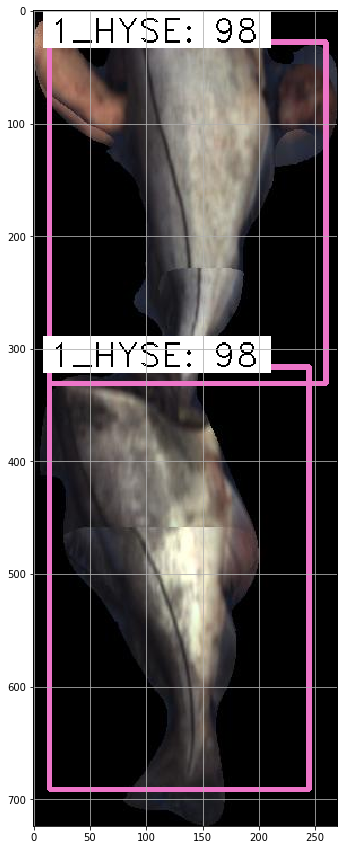{width="3.6145833333333335in"
height="8.854166666666666in"}

En esta imagen el sistema ha localizado dos peces del tipo HYSE
correctamente dentro de la misma imagen.

**Referencias:**

[[https://towardsdatascience.com/faster-r-cnn-object-detection-implemented-by-keras-for-custom-data-from-googles-open-images-125f62b9141a]{.ul}](https://towardsdatascience.com/faster-r-cnn-object-detection-implemented-by-keras-for-custom-data-from-googles-open-images-125f62b9141a)
